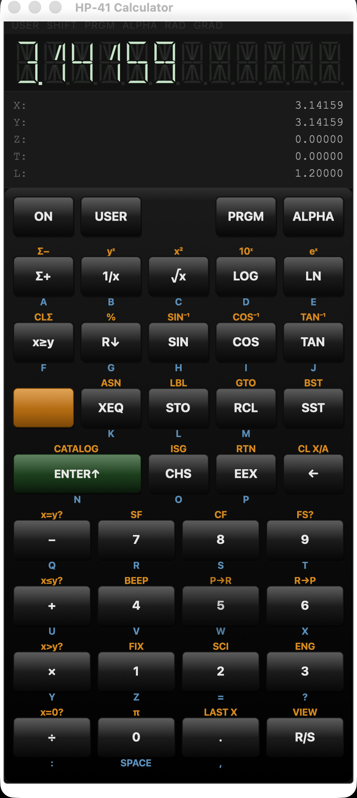

# HP-41 Calculator Emulator

[](https://github.com/talent-factory/hp41-calculator-emulator/actions/workflows/ci.yml)
[](https://github.com/talent-factory/hp41-calculator-emulator/actions/workflows/ci-gui.yml)
[](LICENSE)

<p align="center">
  
  <br>
  <em>HP-41CV desktop GUI on macOS — v2.2 with feature-complete ROM built-ins</em>
</p>

A faithful, open-source behavioral emulation of the **HP-41C/CV/CX** programmable RPN calculator, written in Rust. Ships both a terminal UI (`hp41-cli`) and a pixel-perfect desktop app (`hp41-gui`, Tauri v2 + React).

Implements the full **feature-complete HP-41CV ROM built-in function set** (~130 ops) with documented divergences. See the [HP-41CV function matrix](docs/hp41cv-function-matrix.md) for status per op, keyboard reachability, and known hardware divergences.

```
┌─────────────────────────────────────┐
│  4.0000000000   HP-41CV             │
│─────────────────────────────────────│
│  2  ENTER↑                          │
│  2  ×                               │
│  →  4                               │
└─────────────────────────────────────┘
```

## Releases

| Version | Date | Highlights |
|---------|------|------------|
| [v3.0](https://github.com/talent-factory/hp41-calculator-emulator/releases/tag/v3.0) | 2026-05-20 | **Math Pac I behavioral emulation** (HP 00041-90034, 1979): 10 top-level programs, ~55 XEQ-by-Name entry points across hyperbolics, complex stack, polynomial roots (Bairstow), matrix DET/INV/SIMEQ, INTG (Simpson), SOLVE (secant), DIFEQ (RK4), triangle solvers, Fourier transform, 2D/3D coordinate transforms; modal-workflow state machine + user-callback re-entrancy; CLI ↔ GUI parity via shared `xrom_resolve`; coverage 95.39 % lines / 94.26 % regions; `?` overlay gains incremental substring search; v1.0–v2.2 save files load without migration |
| [v2.2](https://github.com/talent-factory/hp41-calculator-emulator/releases/tag/v2.2) | 2026-05-16 | **Feature-complete HP-41CV ROM built-ins**: ~90 new ops across math/flags/program-control/ALPHA/indirect (Phases 20–24); f-prefix one-shot CLI + GUI parity; 14-segment SVG LCD; JSON-canonical function pipeline; `?` help overlay; USER-mode key relabel; test hardening to 95.25 % coverage + 99.1 % numerical accuracy; WebdriverIO E2E smoke on Linux CI |
| [v2.1](https://github.com/talent-factory/hp41-calculator-emulator/releases/tag/v2.1) | 2026-05-13 | Authentic HP-41C 5×8 keyboard layout, one-shot SHIFT, three-label keys (primary + orange shifted + blue ALPHA), R/S command wiring, stub-error toast pattern |
| [v2.0](https://github.com/talent-factory/hp41-calculator-emulator/releases/tag/v2.0) | 2026-05-10 | Tauri desktop GUI: pixel-perfect SVG skin, IPC layer, shared autosave, PRGM-mode program listing, 3-OS GUI CI |
| [v1.1](https://github.com/talent-factory/hp41-calculator-emulator/releases/tag/v1.1) | 2026-05-09 | CLI feature completeness: hardware-faithful EEX, STO arithmetic modals, PRX/PRA/PRSTK print emulation, synthetic programming (GETKEY, NULL, M/N/O, HexModal) |
| [v1.0](https://github.com/talent-factory/hp41-calculator-emulator/releases/tag/v1.0) | 2026-05-08 | First public release: full RPN engine, keystroke programming, ratatui TUI, JSON persistence, cross-platform CI |

## Features

**Calculator engine (`hp41-core`)**

- Full RPN stack model (X, Y, Z, T + LAST X) with correct stack-lift behaviour for every one of ~130 operations
- 100 numbered storage registers (R00–R99) plus the hidden synthetic registers M, N, O
- ALPHA register (24 chars) and string operations
- ISG/DSE loop counters with string-split semantics (no floating-point rounding errors)
- Keystroke programming: LBL / GTO / XEQ / RTN, all 12 conditional tests, ISG/DSE loops
- Hardware-faithful EEX entry (trailing-e commits as exponent 00; empty-buffer EEX inserts implicit mantissa)
- Print emulation: PRX / PRA / PRSTK push to an in-memory `print_buffer` — `hp41-core` stays I/O-free
- Synthetic programming: GETKEY, NULL, hidden registers M/N/O, 2-digit HexModal over a curated 23-entry safe subset
- Persistent state via JSON at `~/.hp41/autosave.json` — human-readable, version-stable, shared between CLI and GUI
- v3.0 ships Math Pac I behavioral emulation, feature-complete per Owner's Manual 00041-90034
  ([documented divergences](docs/hp41-math1-divergences.md)) — see [Math Pac I Function Matrix](docs/hp41-math1-function-matrix.md)

**Terminal UI (`hp41-cli`)**

- ratatui 0.30 + crossterm — runs on macOS, Linux, Windows
- Persistent 4-level stack display, 12-char HP-41 alphanumeric display, all 5 annunciators
- STO arithmetic keyboard modal (`S → +/−/×/÷ → R00–R99 | Y/Z/T/L`)
- `--print-log <path>` appends PRX/PRA/PRSTK output to a file
- `?` overlay shows the full key reference

**Desktop GUI (`hp41-gui`)**

- Tauri v2 + React + TypeScript — single static window, native packaging on macOS, Windows, Linux
- Authentic HP-41C layout: 4 top-row mode keys + 5×8 main grid + orange SHIFT cap (39 keys total); three-label model (primary white + orange shifted + blue ALPHA letter)
- 14-segment SVG LCD with 49-glyph character map (digits, A–Z, punctuation), dim-off "ghost" segments for authentic LCD aesthetic
- 12-char display, 6 annunciators (incl. SHIFT one-shot), X/Y/Z/T/LASTX stack panel — all keyboard bindings from the CLI work in the GUI too
- `?` help overlay driven by the canonical `docs/hp41cv-functions.json` source — every op searchable in-app
- USER-mode per-key relabel: ASN'd custom labels render on the affected key when USER annunciator is active
- Scrollable PRX/PRA/PRSTK print panel
- PRGM-mode program listing with SST / BST navigation and auto-scroll
- Shared autosave with the CLI: state saved in one binary appears in the other on next launch

## Variants Emulated

This is a **behavioural** emulation — variant-specific memory limits are not enforced; the emulator always provides 100 numbered registers (R00–R99) plus the three hidden synthetic registers, regardless of which physical model the table references.

| Model   | Year | Original memory   | Notes                              |
|---------|------|-------------------|------------------------------------|
| HP-41C  | 1979 | 63 registers      | Base model                         |
| HP-41CV | 1980 | 319 registers     | "Continuously Variable" memory     |
| HP-41CX | 1983 | Extended + Time   | Built-in X-Functions & Time Module |

## Quick Start

```bash
# Prerequisites: Rust stable (MSRV 1.88), just
cargo install just
```

**Terminal UI (`hp41-cli`):**

```bash
just run                # build + launch the TUI
just test               # run all tests
just ci                 # full CLI gate: lint → test → coverage (≥95 % on hp41-core)
just run -- --print-log /tmp/hp41.log   # append PRX/PRA/PRSTK output to a file
```

**Desktop GUI (`hp41-gui`):**

```bash
# Additional prerequisites: Node.js + npm; see hp41-gui/README for OS-specific
# WebKit / webkit2gtk requirements on Linux
just gui-dev            # launch the Tauri dev window
just gui-build          # release build (produces a native bundle)
just gui-ci             # GUI gate: cargo test + cargo build --release
just gui-check          # cargo check + tsc --noEmit
```

The GUI and CLI share state via `~/.hp41/autosave.json` — they auto-save every 30 s and load each other's state on launch.

## Documentation

| Document | Description |
|----------|-------------|
| [HP-41 Overview](docs/hp41-overview.md) | History, variants, RPN introduction |
| [Operations Reference](docs/operations-reference.md) | All ~130 operations by category |
| [Function Matrix](docs/hp41cv-function-matrix.md) | Per-op status, keyboard path, divergences |
| [Math Pac I Function Matrix](docs/hp41-math1-function-matrix.md) | Math Pac I XROM entries with module/function IDs |
| [Keyboard Layout](docs/keyboard-layout.md) | Key layout and shifted functions |
| [Programming Guide](docs/programming-guide.md) | Stack model, programs, flags, loops |
| [Architecture](docs/architecture.md) | Emulator internals for contributors |

## Documented Divergences from HP-41 Hardware

A small set of deliberate behavioral divergences from the real HP-41C/CV/CX; each is recorded as a per-row `divergences` entry in the [function matrix](docs/hp41cv-function-matrix.md):

- **PI** — 10-digit rounded value (`3.141592654`); hardware uses the same internal 10-digit precision.
- **FACT** — effective cap at X ≤ 26 (Decimal-range overflow at n=27 via the `Decimal::from_f64` wall, calibrated by Phase 27 proptest); HP-41 caps at X ≤ 69. X in 27..=69 returns `Overflow`.
- **CLP** — boundary is the next `LBL` marker; HP-41 uses `END` / `.END.` markers (not present in our flat-Vec program model).
- **PACK** — no-op; HP-41 compacts program memory (we have no gaps to compact in the flat-Vec model).
- **POSA** — single-char only; multi-char POSA is deferred to v3.x (requires typed-stack shadow channel).
- **AROT** — silently truncates non-integer N toward zero; HP-41 rejects non-integer N.
- **HP-41 upper-ASCII (codes 128–255)** in ATOX / XTOA — round-trip not preserved (HP-41 ROM glyphs are not in the UTF-8 model).
- **ALPHA mode overrides f-prefix** — by design (D-25.5 / D-26 in CLAUDE.md); pressing `f` in ALPHA mode types the literal `F` instead of arming the prefix. Hardware-faithful ALPHA-with-prefix (Σ, π, μ, …) is deferred to v3.x alongside the ALPHA-special-charset table.

### Official HP Manuals

- [HP-41C/CV Owner's Manual](https://www.hpmuseum.org/41ownman.htm) — Museum of HP Calculators
- [HP-41C/CV/CX Advanced Functions Handbook](https://www.hpmuseum.org/41advfun.htm)
- [HP-41CX Owner's Manual](https://www.hpmuseum.org/41cxman.htm)
- [HP-41 Programming](https://www.hpmuseum.org/prog/hp41prog.htm) — hpmuseum.org

## Project Structure

```
hp41-core/                — UI-agnostic library (calculator engine, zero CLI/UI dependencies)
hp41-cli/                 — Terminal UI binary (ratatui + crossterm)
hp41-gui/                 — Tauri v2 desktop app (nested standalone workspace)
  ├── src-tauri/          — Rust backend (IPC commands, persistence, prgm display)
  └── src/                — React + TypeScript frontend (App.tsx, Keyboard.tsx)
```

The root Cargo workspace declares `members = ["hp41-core", "hp41-cli"]`; `hp41-gui` is a **nested standalone workspace** so the `tauri` / `tauri-build` dependencies never enter the root resolver. `cargo build --workspace` from the repo root does not touch the Tauri binary.

## Contributing

See [CONTRIBUTING.md](CONTRIBUTING.md). All contributions target the `develop` branch via Pull Request.  
Direct pushes to `develop` and `main` are restricted to the maintainer.

## License

MIT — see [LICENSE](LICENSE).
